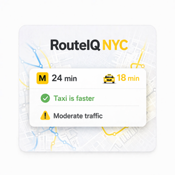

# 🚇 RouteIQ NYC — Preview Landing Page

This repository hosts the static landing page used to generate rich link previews for the RouteIQ NYC project.

When shared via text, LinkedIn, or other platforms, this page ensures the project displays a clean, visual preview instead of a raw link.

---

## 📸 Preview

---

## 🧠 Purpose

Modern apps are often first experienced through shared links.

This landing page is designed to:
- Provide a visually appealing preview
- Communicate the core idea instantly
- Improve how the project appears when shared

---

## 🔗 Main Project

👉 Full application:  
https://github.com/dane-anderson/routeiq-nyc

---

## ⚙️ How It Works

- Static HTML page (`index.html`)
- Preview image (`preview.png`)
- Metadata (Open Graph tags) for link previews

Platforms like iMessage, LinkedIn, and Twitter use this metadata to render the preview.

---

## 🚀 Why This Matters

Most student projects stop at functionality.

This project goes one step further by:
- controlling how it is presented externally
- improving first impressions
- making the project feel like a real product

---

## 👤 Author

Dane Anderson  
CU Boulder — Computer Science  
Focused on AI systems, decision engines, and real-world applications
